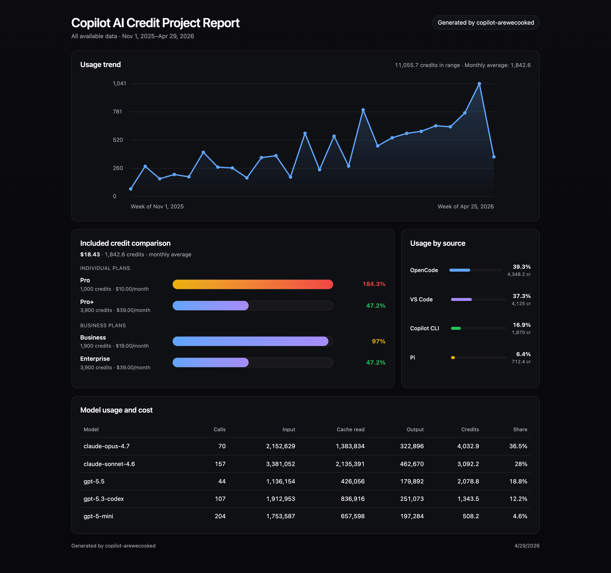

<div align="center">

# Yo GitHub Copilot: are we cooked?

</div>

Estimate your GitHub Copilot AI-credit cost in preparation for June 1st.
Pulls usage from VS Code, OpenCode, Pi, and GitHub Copilot CLI, aggregates it based on the new per-token pricing, and generates a local HTML report. **Fully local**.



#### Relevant links

- [April 27th, 2026: GitHub Copilot is moving to usage-based billing](https://github.blog/news-insights/company-news/github-copilot-is-moving-to-usage-based-billing/)
- [Models and per-token pricing for GitHub Copilot](https://docs.github.com/en/copilot/reference/copilot-billing/models-and-pricing#model-multipliers-for-annual-copilot-pro-and-copilot-pro-subscribers)
- [Usage-based billing for individuals](https://docs.github.com/en/copilot/concepts/billing/usage-based-billing-for-individuals)
- [Usage-based billing for organizations and enterprises](https://docs.github.com/en/copilot/concepts/billing/usage-based-billing-for-organizations-and-enterprises)

> TL;DR: GitHub Copilot is moving from premium-request quotas to per-token billing on June 1st. Agentic workflows can now cost more than the old premium-request mental model suggests.

## Just let your agent do it

Don't want to run this yourself? Paste this prompt into your coding agent:

```
Clone https://github.com/PanAchy/copilot-arewecooked, install dependencies, build it, and run it.
Then open the generated HTML report and tell me whether or not I'm going to be cooked under the new Copilot AI-credit billing.
```

## Setup

The quickest way (requires Node.js 20+):

```bash
npx copilot-arewecooked
```

Or clone and build:

```bash
git clone https://github.com/PanAchy/copilot-arewecooked.git
cd copilot-arewecooked
npm install
npm run build
npm run generate
```

By default, this writes an HTML report and PNG screenshot like:

```text
copilot-report-YYYY-MM-DD-abc123.html
copilot-report-YYYY-MM-DD-abc123.png
```

### Options

| Flag         | Description                                     |
| ------------ | ----------------------------------------------- |
| `--days <n>` | Days to look back (default: all available data) |
| `--json`     | Print detailed normalized JSON to stdout        |
| `--html`     | Write HTML report to a specific path            |

```bash
npm run generate -- --days 30
npm run generate -- --html report.html
npm run generate -- --json
```

## How data is extracted

| Source          | Paths                                                                                                                                                                                                                                                                                 | Token accuracy                                     |
| --------------- | ------------------------------------------------------------------------------------------------------------------------------------------------------------------------------------------------------------------------------------------------------------------------------------- | -------------------------------------------------- |
| **VS Code**     | `~/Library/Application Support/Code{, - Insiders}/User/workspaceStorage/*/chatSessions/*.jsonl` (macOS) · `%APPDATA%/Code{, - Insiders}/User/workspaceStorage/*/chatSessions/*.jsonl` (Windows) · `~/.config/Code{, - Insiders}/User/workspaceStorage/*/chatSessions/*.jsonl` (Linux) | Input estimated, output exact, cache not persisted |
| **OpenCode**    | `~/.local/share/opencode/opencode.db` (macOS and Linux) · `%LOCALAPPDATA%/opencode/opencode.db` / `%APPDATA%/opencode/opencode.db` (Windows)                                                                                                                                          | All exact (input, output, cache read/write)        |
| **Pi**          | `~/.pi/agent/sessions/**/*.jsonl` (all platforms)                                                                                                                                                                                                                                     | All exact (input, output, cache read/write)        |
| **Copilot CLI** | `~/.copilot/session-state/*/events.jsonl` (all platforms)                                                                                                                                                                                                                             | Output exact, input estimated, compaction exact    |
